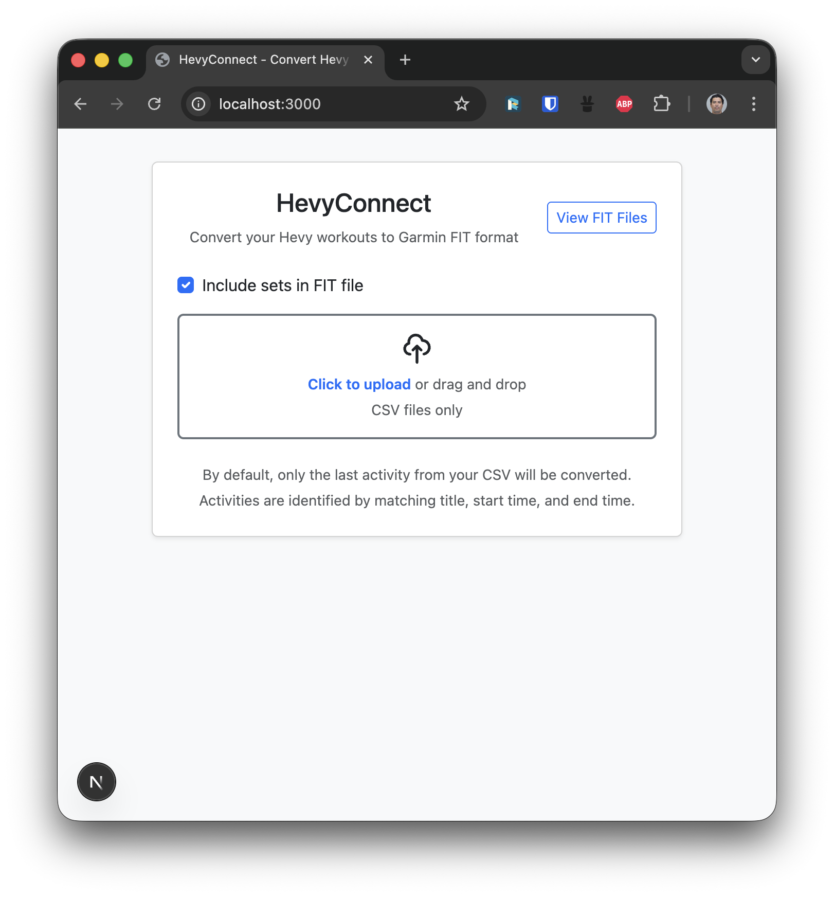
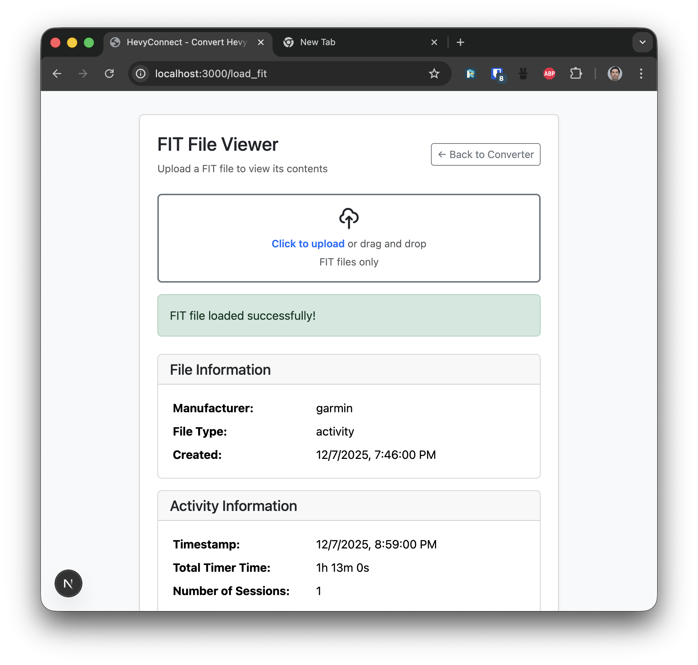
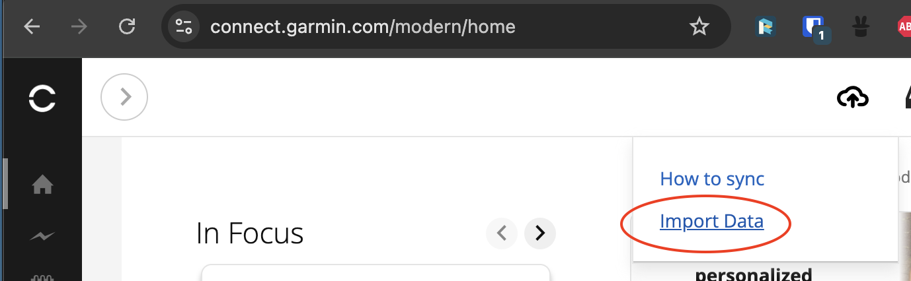
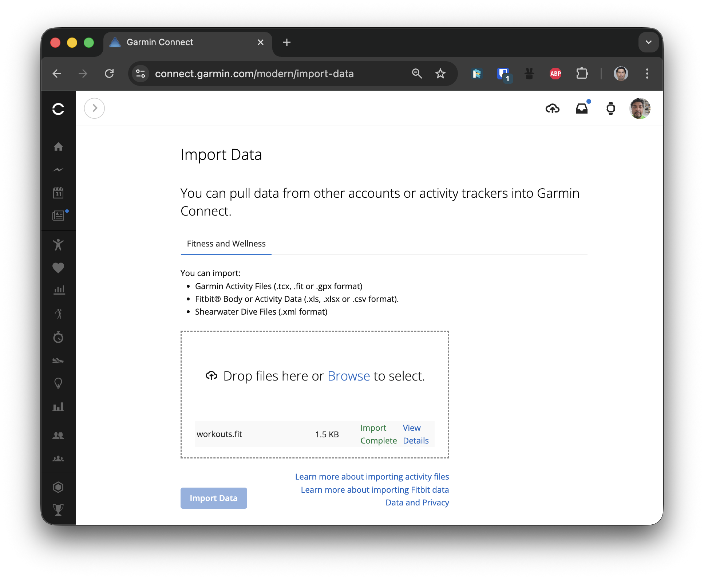
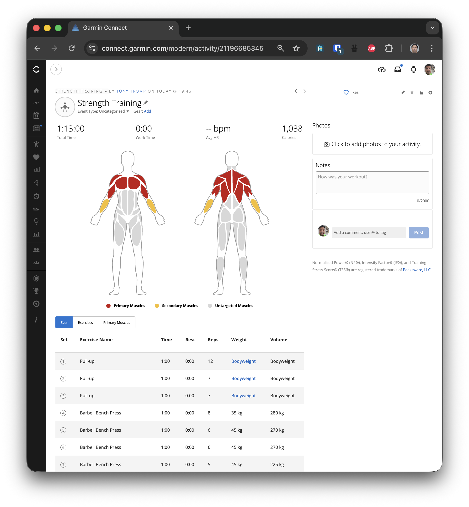

If you like this project, help me through this morning's workout with a Coffee.

<a href="https://www.buymeacoffee.com/tonytromp" target="_blank"></a>

Thanks for your support :heart:

# HevyConnect

A Next.js application that converts Hevy CSV workout files to Garmin FIT format, allowing you to seamlessly sync your strength training workouts from Hevy to Garmin Connect.

By default all exercises are mapped between Hevy and Garmin FIT file format. Checkout the file: `public/exercise-lookup-table.json`. Garmin does not allow free-format text as Exercise names, so they need to be mapped using this file. If the mapping doesn't exist, it will try and use Fuzzy matching to map the right exercise, but best to set the mapping in the file.

## Features

- Drag & drop CSV file upload / download converted FIT file
- Processes the last activity from the CSV file
- Option to include or exclude detailed sets in the FIT file
- View and inspect FIT file contents
- Automatic exercise name matching to Garmin exercise database
- Calorie estimation based on workout duration and volume

## Known Issues / Unresolved

- Hevy doesn't export the time per exercise (and rest), so we put standard 1 minute timer. You can adjust later in Garmin Connect if needed.
- If the Exercise is wrongly named: check/edit the Lookup Table JSON location in `public/exercise-lookup-table.json`. This file is the mapping between exercises in Garmin and Hevy (Garmin doesn't allow free-form text, so all exercises are mapped).

## Complete Workflow Guide

### Step 1: Export Your Workout from Hevy

1. **Open the Hevy web and login ** https://hevy.com/

2. **Navigate to Your Exports**
   - https://hevy.com/settings?export

### Step 2: Convert CSV to FIT Format

1. **Open HevyConnect**
   - Build: docker compose build
   - Run: docker compose up
   - Navigate to `http://localhost:3000` (if running locally)
   - Or use the deployed version of HevyConnect

   

2. **Upload Your CSV File**
   - **Option A:** Drag and drop your Hevy CSV file onto the upload area
   - **Option B:** Click on the upload area to open a file selector, then choose your CSV file

3. **Configure Conversion Options**
   - **Include sets in FIT file:** Check this box if you want detailed set information (reps, weight, duration) included in the FIT file. Uncheck if you only want workout summary data.

4. **Wait for Conversion**
   - The application will automatically process the last activity from your CSV file
   - Activities are identified by matching title, start time, and end time
   - A progress spinner will appear while processing

5. **Download the FIT File**
   - Once conversion is complete, the FIT file will automatically download
   - The file will be named the same as your CSV file but with a `.fit` extension
   - Example: `workouts.csv` → `workouts.fit`

6. **Optional: View FIT File Contents**
   - Click the **"View FIT Files"** button in the top right corner
   - Upload your generated FIT file to inspect its contents
   - Verify that all data looks correct before importing to Garmin Connect

   

### Step 3: Upload to Garmin Connect

1. **Log in to Garmin Connect**
   - Open a web browser and go to [connect.garmin.com](https://connect.garmin.com)
   - Log in with your Garmin account credentials

2. **Navigate to Import**
   - Click on the **"Activities"** tab in the top navigation
   - Click on **"Import Data"** (usually found in the left sidebar or under a menu)

   

3. **Upload the FIT File**
   - Click **"Browse"** or **"Choose File"**
   - Navigate to where you downloaded the FIT file (usually your Downloads folder)
   - Select the `.fit` file (e.g., `workouts.fit`)
   - Click **"Upload"** or **"Import"**

   

4. **Verify Your Workout**
   - After upload, Garmin Connect will process the file
   - Navigate to **"Activities"** → **"All Activities"** to find your imported workout
   - The workout should appear with:
     - Correct start and end times
     - Total duration (should match your Hevy workout)
     - Sport type: Strength Training
     - Exercise details (if sets were included)
     - Estimated calories burned

   

5. **Review and Edit (Optional)**
   - Click on the imported activity to view details
   - You can edit the activity name, add notes, or adjust exercise information if needed
   - Garmin Connect may automatically categorize exercises based on the FIT file data

## Troubleshooting

### CSV File Issues
- **"No activity found"**: Make sure your CSV file contains completed workouts with valid start and end times
- **"CSV file is empty"**: Verify the file was exported correctly from Hevy and isn't corrupted

### FIT File Import Issues
- **"Invalid file format"**: Make sure you're uploading a `.fit` file, not the original `.csv` file
- **"Import failed"**: Try converting again with the "Include sets" option unchecked
- **Incorrect time/duration**: Verify your Hevy workout has correct start and end times

### Exercise Name Issues
- If exercises appear with incorrect names in Garmin Connect, the converter uses fuzzy matching to find the closest Garmin exercise
- Some exercises may default to "Total Body" category if no close match is found
- You can manually edit exercise names in Garmin Connect after import
- To fix exercise mappings permanently, edit `public/exercise-lookup-table.json` and add the correct mapping

## Development

### Prerequisites

- Node.js 20 or higher
- npm

### Installation

```bash
npm install
```

### Run Development Server

```bash
npm run dev
```

The application will be available at `http://localhost:3000`

## Docker

### Prerequisites for Fast Builds

Enable BuildKit for faster builds with cache mounts:

```bash
export DOCKER_BUILDKIT=1
export COMPOSE_DOCKER_CLI_BUILD=1
```

Or add to your `~/.bashrc` or `~/.zshrc`:
```bash
export DOCKER_BUILDKIT=1
export COMPOSE_DOCKER_CLI_BUILD=1
```

### Quick Start

**Option 1: Use the build script (recommended)**
```bash
./docker-build.sh
docker-compose up
```

**Option 2: Manual build**
```bash
docker-compose up --build
```

The application will be available at `http://localhost:3000`

### Build Performance

- **First build:** 2-5 minutes (downloads dependencies)
- **Subsequent builds:** 30-90 seconds (with BuildKit cache)

**Important:** Make sure Docker has sufficient resources allocated (at least 4GB RAM, 4 CPU cores). Check Docker Desktop → Settings → Resources.

### Build Docker Image

```bash
docker build -t hevyconnect -f Dockerfile.fast .
```

### Run Docker Container

```bash
docker run -p 3000:3000 hevyconnect
```

## Project Structure

- `app/` - Next.js app directory with pages and API routes
- `components/` - React components (FileUpload, FitFileUpload, FitFileViewer)
- `lib/` - Core conversion logic (CSV parsing, FIT conversion, exercise matching)
- `types/` - TypeScript type definitions
- `public/` - Static files (exercise lookup table)
- `img/` - Documentation images

## How It Works

1. **CSV Parsing**: The application parses Hevy CSV files to extract workout data including exercises, sets, weights, reps, and timestamps.

2. **Activity Extraction**: By default, only the last activity (identified by matching title, start time, and end time) is converted.

3. **FIT Conversion**: The workout data is converted to Garmin FIT format using the `@garmin/fitsdk` library, including:
   - File ID and device information
   - Activity and session messages
   - Lap data
   - Set/strength training data (if included)
   - Exercise name matching to Garmin exercise database
   - Calorie estimation based on workout duration and volume

4. **Exercise Matching**: The converter uses a lookup table (`public/exercise-lookup-table.json`) and fuzzy matching to map Hevy exercise names to Garmin exercise categories and IDs. If an exact match is found in the lookup table, it uses that. Otherwise, it falls back to fuzzy matching against Garmin exercise names.

5. **Calorie Calculation**: Calories are estimated using a formula that considers both workout duration and total volume (weight × reps):
   - Base: 5.5 calories per minute
   - Volume bonus: 0.1 calories per kg-rep

## License

ISC
